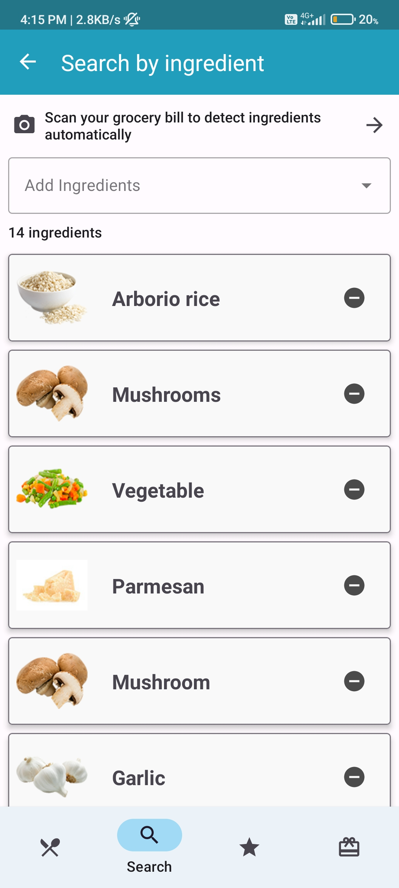
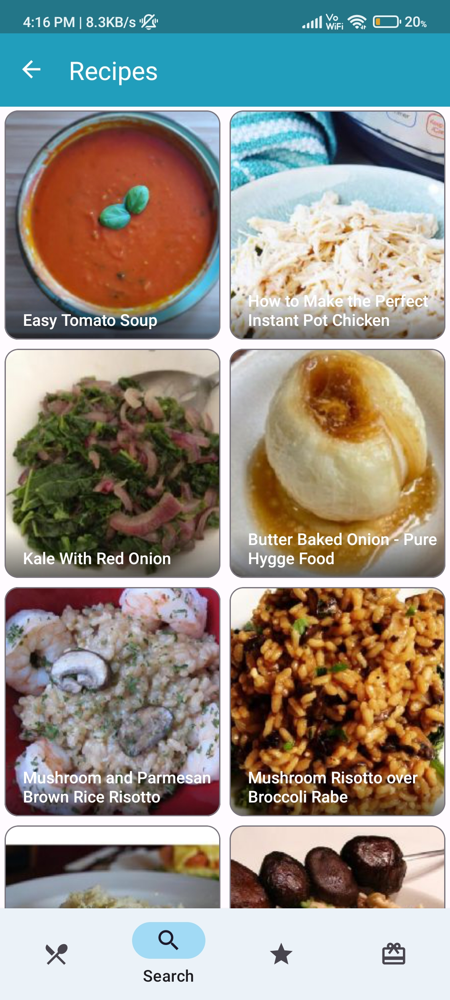

# FoodZen: Make cooking experiences tasty and hassle-free

Discover delicious recipes from around the world with the FoodZen App! Quickly search for recipes by name and ingredients, filter by cuisine, save your favorites, and share recipes as cards and links. With step-by-step instructions and offline caching, cooking has never been easier! Plus, you can find perfect recipes based on your grocery purchases - just scan your bill and get fantastic ideas! Trust FoodZen to make your cooking experiences tasty and hassle-free.

## Features

- Scan grocery bills to find recipes based on purchases ingredients
- Search recipes by name and ingredients
- Filter recipes based on cuisines 
- Support for Offline caching
- Save recipes and mark them as favorite
- Share recipes as cards and links
- See step-by-step instructions for a recipe

## Screenshots

|**Splash**|**Filter Recipes**|**Search Recipes**| 
|:---------------------------:|:---------------------------:|:---------------------------:|
|  |   |  |
| **Favourite Recipes** | **Recipe Card** | **Recipe Details** |
|  |   |  |
| **Recipe Ingredients** | **Recipe step-by-step breakdown** | **Search Recipes By Ingredient** |
|  |   |  |
|**Search Recipes By Ingredient Results**|
|  | 

## Libraries Used
- MLKit for OCR
- Retrofit to fetch food recipes API
- Room DB for offline caching
- Dagger Hilt for dependency injection
- Navigation component for fragment navigation
- Jetpack datastore for saving user preferences

**Note** - Source code for the project has been uploaded to different repositories
